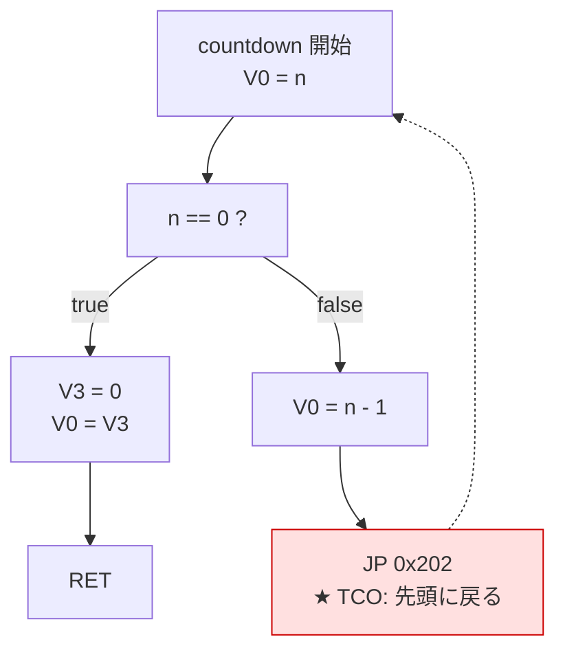

# コンパイルトレース: hello.ch8l の全パイプライン追跡

このドキュメントでは、`examples/hello.ch8l` がソースコードから CHIP-8 ROM バイナリになるまでの全過程を、パイプラインの各ステージごとに追跡する。

## 対象ソースコード

```
-- hello.ch8l: 画面に数字を表示する最小サンプル

let digit_sprite: sprite(1) = [0b11110000];

fn main() -> () {
  clear();
  -- 画面中央付近に数字スプライトを描画
  let x: u8 = 28;
  let y: u8 = 14;
  draw(digit_sprite, x, y);
  -- キー入力待ちで停止
  let k: u8 = wait_key();
}
```

## パイプライン全体像

```
ソースコード (.ch8l)
  │
  ▼
Lexer     ── 文字列 → トークン列
  │
  ▼
Parser    ── トークン列 → AST (抽象構文木)
  │
  ▼
Analyzer  ── AST → 検証済み AST (型チェック・スコープ解決)
  │
  ▼
CodeGen   ── AST → Vec<u8> (CHIP-8 バイトコード)
  │
  ▼
Emitter   ── Vec<u8> → .ch8 ファイル (バイナリ出力)
```

---

## Stage 1: Lexer (字句解析)

**入力**: ソースコード文字列
**出力**: `Vec<Token>`
**実装**: `src/lexer/mod.rs`

Lexer はソースコードを先頭から1文字ずつ読み進め、意味のある最小単位 (トークン) に分割する。コメント (`--`) と空白は読み飛ばされる。

### Rust 関数呼び出しチェイン

```
Lexer::new(&source) → Lexer { input: Vec<char>, pos: 0, line: 1, column: 1 }
│
Lexer::tokenize(&mut self) → Result<Vec<Token>, LexError>
│
├─ next_token() → Result<Token, LexError>      // "let"
│  ├─ skip_whitespace()
│  ├─ skip_comment()                            // "--" で始まるならコメント行をスキップ
│  └─ read_ident() → Token                     // 英字で始まる → 識別子 or キーワード
│     └─ keyword match: "let" → TokenKind::Let
│
├─ next_token()                                 // "digit_sprite"
│  └─ read_ident() → Token { kind: Ident("digit_sprite") }
│
├─ next_token()                                 // ":"
│  └─ read_punct() → Token { kind: Colon }
│
├─ next_token()                                 // "sprite"
│  └─ read_ident() → Token { kind: Ident("sprite") }
│
├─ next_token()                                 // "0b11110000"
│  └─ read_number() → Result<Token, LexError>
│     └─ read_binary_number(span) → Token { kind: IntLiteral(240) }
│        // '0','1' を collect して u64::from_str_radix(s, 2)
│
├─ ... (残りのトークンも同様に next_token → read_ident/read_number/read_punct)
│
├─ next_token()                                 // "clear"
│  └─ read_ident() → Token { kind: Ident("clear") }
│     // "clear" はキーワード一覧にないので Ident になる
│
└─ next_token()                                 // EOF
   └─ peek() == None → Token { kind: Eof }
```

### トークン列

```
Token { kind: Let,                  span: 3:1  }   -- "let"
Token { kind: Ident("digit_sprite"),span: 3:5  }   -- "digit_sprite"
Token { kind: Colon,                span: 3:17 }   -- ":"
Token { kind: Ident("sprite"),      span: 3:19 }   -- "sprite"
Token { kind: LParen,              span: 3:25 }   -- "("
Token { kind: IntLiteral(1),       span: 3:26 }   -- "1"
Token { kind: RParen,              span: 3:27 }   -- ")"
Token { kind: Eq,                  span: 3:29 }   -- "="
Token { kind: LBracket,            span: 3:31 }   -- "["
Token { kind: IntLiteral(240),     span: 3:32 }   -- "0b11110000" → 240
Token { kind: RBracket,            span: 3:42 }   -- "]"
Token { kind: Semicolon,           span: 3:43 }   -- ";"

Token { kind: Fn,                  span: 5:1  }   -- "fn"
Token { kind: Ident("main"),       span: 5:4  }   -- "main"
Token { kind: LParen,              span: 5:8  }   -- "("
Token { kind: RParen,              span: 5:9  }   -- ")"
Token { kind: Arrow,               span: 5:11 }   -- "->"
Token { kind: LParen,              span: 5:14 }   -- "("
Token { kind: RParen,              span: 5:15 }   -- ")"
Token { kind: LBrace,              span: 5:17 }   -- "{"

Token { kind: Ident("clear"),      span: 6:3  }   -- "clear"
Token { kind: LParen,              span: 6:8  }   -- "("
Token { kind: RParen,              span: 6:9  }   -- ")"
Token { kind: Semicolon,           span: 6:10 }   -- ";"

Token { kind: Let,                  span: 8:3  }   -- "let"
Token { kind: Ident("x"),          span: 8:7  }   -- "x"
Token { kind: Colon,                span: 8:8  }   -- ":"
Token { kind: Ident("u8"),         span: 8:10 }   -- "u8"
Token { kind: Eq,                  span: 8:13 }   -- "="
Token { kind: IntLiteral(28),      span: 8:15 }   -- "28"
Token { kind: Semicolon,           span: 8:17 }   -- ";"

Token { kind: Let,                  span: 9:3  }   -- "let"
Token { kind: Ident("y"),          span: 9:7  }   -- "y"
Token { kind: Colon,                span: 9:8  }   -- ":"
Token { kind: Ident("u8"),         span: 9:10 }   -- "u8"
Token { kind: Eq,                  span: 9:13 }   -- "="
Token { kind: IntLiteral(14),      span: 9:15 }   -- "14"
Token { kind: Semicolon,           span: 9:17 }   -- ";"

Token { kind: Ident("draw"),       span: 10:3 }   -- "draw"
Token { kind: LParen,              span: 10:7 }   -- "("
Token { kind: Ident("digit_sprite"),span: 10:8}   -- "digit_sprite"
Token { kind: Comma,               span: 10:20}   -- ","
Token { kind: Ident("x"),          span: 10:22}   -- "x"
Token { kind: Comma,               span: 10:23}   -- ","
Token { kind: Ident("y"),          span: 10:25}   -- "y"
Token { kind: RParen,              span: 10:26}   -- ")"
Token { kind: Semicolon,           span: 10:27}   -- ";"

Token { kind: Let,                  span: 12:3 }   -- "let"
Token { kind: Ident("k"),          span: 12:7 }   -- "k"
Token { kind: Colon,                span: 12:8 }   -- ":"
Token { kind: Ident("u8"),         span: 12:10}   -- "u8"
Token { kind: Eq,                  span: 12:13}   -- "="
Token { kind: Ident("wait_key"),   span: 12:15}   -- "wait_key"
Token { kind: LParen,              span: 12:23}   -- "("
Token { kind: RParen,              span: 12:24}   -- ")"
Token { kind: Semicolon,           span: 12:25}   -- ";"

Token { kind: RBrace,              span: 13:1 }   -- "}"
Token { kind: Eof,                 span: 14:1 }
```

### 注目ポイント

- `0b11110000` (2進リテラル) が `IntLiteral(240)` に変換される
- `clear`, `draw`, `wait_key` はこの段階では単なる `Ident` — 組み込み関数かどうかは Parser が判断する
- コメント行 (`-- ...`) は完全にスキップされる
- `->` は 2 文字で1つの `Arrow` トークンになる

---

## Stage 2: Parser (構文解析)

**入力**: `Vec<Token>`
**出力**: `Program` (AST)
**実装**: `src/parser/mod.rs`

Parser はトークン列を再帰下降法で読み進め、プログラムの木構造 (AST) を構築する。関数呼び出し名が `BuiltinFunction::from_name()` でマッチする場合、`Call` ではなく `BuiltinCall` として AST に記録される。

### Rust 関数呼び出しチェイン

```
Parser::new(tokens) → Parser { tokens, pos: 0 }
│
Parser::parse_program(&mut self) → Result<Program, ParseError>
│
├─ parse_top_level() → Result<TopLevel, ParseError>    // "let digit_sprite ..."
│  └─ parse_let_def() → Result<TopLevel, ParseError>
│     ├─ expect_ident() → "digit_sprite"
│     ├─ expect(Colon)
│     ├─ parse_type() → Type::Sprite(1)
│     │  // Ident("sprite"), LParen, IntLiteral(1), RParen
│     ├─ expect(Eq)
│     ├─ parse_expr() → ArrayLiteral([IntLiteral(240)])
│     │  └─ parse_expr_bp(0)
│     │     └─ parse_unary()
│     │        └─ parse_postfix()
│     │           └─ parse_primary()              // LBracket を検出
│     │              └─ parse_expr() × 1          // 配列要素ごとに
│     │                 └─ ... → IntLiteral(240)
│     └─ expect(Semicolon)
│
└─ parse_top_level()                                    // "fn main() -> () { ... }"
   └─ parse_fn_def() → Result<TopLevel, ParseError>
      ├─ expect_ident() → "main"
      ├─ parse_params() → []                            // 空の引数リスト
      ├─ expect(Arrow)
      ├─ parse_type() → Type::Unit                      // "()"
      └─ parse_block_expr() → Block { stmts, expr: None }
         │
         ├─ parse_stmt()                                // "clear();"
         │  └─ parse_expr() → BuiltinCall(Clear, [])
         │     └─ parse_expr_bp(0)
         │        └─ parse_unary()
         │           └─ parse_postfix()
         │              └─ parse_primary()              // Ident("clear")
         │                 ├─ BuiltinFunction::from_name("clear") → Some(Clear)
         │                 └─ parse_call_args() → []
         │
         ├─ parse_stmt()                                // "let x: u8 = 28;"
         │  └─ StmtKind::Let
         │     ├─ parse_type() → U8
         │     └─ parse_expr() → IntLiteral(28)
         │
         ├─ parse_stmt()                                // "let y: u8 = 14;"
         │  └─ (同上)
         │
         ├─ parse_stmt()                                // "draw(digit_sprite, x, y);"
         │  └─ parse_expr() → BuiltinCall(Draw, [...])
         │     └─ parse_primary()
         │        ├─ BuiltinFunction::from_name("draw") → Some(Draw)
         │        └─ parse_call_args() → [Ident("digit_sprite"), Ident("x"), Ident("y")]
         │           └─ parse_expr() × 3
         │
         └─ parse_stmt()                                // "let k: u8 = wait_key();"
            └─ StmtKind::Let
               └─ parse_expr() → BuiltinCall(WaitKey, [])
                  └─ parse_primary()
                     ├─ BuiltinFunction::from_name("wait_key") → Some(WaitKey)
                     └─ parse_call_args() → []
```

### AST

```
Program {
  top_levels: [
    LetDef {
      name: "digit_sprite",
      ty: Sprite(1),
      value: ArrayLiteral([IntLiteral(240)]),
      mutable: false,
      span: 3:1
    },
    FnDef {
      name: "main",
      params: [],
      return_type: Unit,
      body: Block {
        stmts: [
          Expr(BuiltinCall { builtin: Clear, args: [] }),
          Let { name: "x", ty: U8, value: IntLiteral(28) },
          Let { name: "y", ty: U8, value: IntLiteral(14) },
          Expr(BuiltinCall {
            builtin: Draw,
            args: [Ident("digit_sprite"), Ident("x"), Ident("y")]
          }),
          Let {
            name: "k",
            ty: U8,
            value: BuiltinCall { builtin: WaitKey, args: [] }
          }
        ],
        expr: None    -- ブロック末尾に式がない → Unit 型
      },
      span: 5:1
    }
  ]
}
```

### AST の木構造 (Mermaid)

```mermaid
graph TD
    Program["Program"]

    Program --> LetDef["TopLevel::LetDef<br/>name = digit_sprite"]
    Program --> FnDef["TopLevel::FnDef<br/>name = main"]

    %% ---- LetDef: digit_sprite ----
    LetDef --> LetDef_ty["ty: Sprite&#40;1&#41;"]
    LetDef --> LetDef_val["value: ArrayLiteral"]
    LetDef_val --> LetDef_elem["IntLiteral&#40;240&#41;"]

    %% ---- FnDef: main ----
    FnDef --> FnDef_ret["return_type: Unit"]
    FnDef --> FnDef_body["body: Block<br/>expr = None"]

    %% ---- Block stmts ----
    FnDef_body --> Stmt1["Stmt::Expr"]
    FnDef_body --> Stmt2["Stmt::Let<br/>name = x, ty = U8"]
    FnDef_body --> Stmt3["Stmt::Let<br/>name = y, ty = U8"]
    FnDef_body --> Stmt4["Stmt::Expr"]
    FnDef_body --> Stmt5["Stmt::Let<br/>name = k, ty = U8"]

    %% ---- Stmt1: clear ----
    Stmt1 --> Clear["BuiltinCall: Clear<br/>args = none"]

    %% ---- Stmt2: let x = 28 ----
    Stmt2 --> Stmt2_val["IntLiteral&#40;28&#41;"]

    %% ---- Stmt3: let y = 14 ----
    Stmt3 --> Stmt3_val["IntLiteral&#40;14&#41;"]

    %% ---- Stmt4: draw ----
    Stmt4 --> Draw["BuiltinCall: Draw"]
    Draw --> Draw_a1["Ident: digit_sprite"]
    Draw --> Draw_a2["Ident: x"]
    Draw --> Draw_a3["Ident: y"]

    %% ---- Stmt5: let k = wait_key ----
    Stmt5 --> WaitKey["BuiltinCall: WaitKey<br/>args = none"]

    %% ---- styling ----
    classDef topLevel fill:#e8f4fd,stroke:#4a90d9
    classDef stmt fill:#fdf6e3,stroke:#b58900
    classDef expr fill:#f0fff0,stroke:#2e8b57
    classDef leaf fill:#fff0f5,stroke:#cd5c5c

    class Program topLevel
    class LetDef,FnDef topLevel
    class Stmt1,Stmt2,Stmt3,Stmt4,Stmt5 stmt
    class Clear,Draw,WaitKey,LetDef_val expr
    class LetDef_elem,Stmt2_val,Stmt3_val,Draw_a1,Draw_a2,Draw_a3,LetDef_ty,FnDef_ret,FnDef_body leaf
```



### 注目ポイント

- **`clear()` → `BuiltinCall { builtin: Clear }`**: Parser が関数名 `"clear"` を `BuiltinFunction::from_name()` で解決し、通常の `Call` ではなく `BuiltinCall` として AST に記録する
- **`sprite(1)` → `Type::Sprite(1)`**: 型注釈 `sprite(n)` が専用の型 `Sprite(n)` にパースされる。これはバイト配列と互換だが、スプライトの高さ情報を保持する
- **`[0b11110000]` → `ArrayLiteral([IntLiteral(240)])`**: 配列リテラルの各要素は式として保持される
- **`Block.expr: None`**: ブロック末尾がセミコロンで終わるため、末尾式がなく Unit 型を返す

---

## Stage 3: Analyzer (意味解析)

**入力**: `Program` (AST)
**出力**: `Result<(), Vec<AnalyzeError>>` — 成功すれば `Ok(())`
**実装**: `src/analyzer/mod.rs`

Analyzer は AST を2パスで走査し、プログラムの意味的な正しさを検証する。AST 自体は変更しない。

### Rust 関数呼び出しチェイン

```
Analyzer::new() → Analyzer { globals: {}, functions: {}, enums: {}, structs: {}, ... }
│
Analyzer::analyze(&mut self, &Program) → Result<(), Vec<AnalyzeError>>
│
├─ [Pass 1] トップレベル定義を走査して登録
│  ├─ LetDef "digit_sprite" → globals.insert("digit_sprite", Sprite(1))
│  └─ FnDef "main" → functions.insert("main", FnSig { params: [], return_type: Unit })
│
├─ main 存在チェック: functions.contains_key("main") → true ✓
│
└─ [Pass 2] 各定義の本体を型チェック
   │
   ├─ LetDef "digit_sprite":
   │  └─ type_check_expr(&ArrayLiteral) → Some(Array(U8, 1))
   │     └─ type_check_expr(&IntLiteral(240)) → Some(U8)
   │     types_compatible(Sprite(1), Array(U8, 1)) → true ✓
   │
   └─ FnDef "main":
      ├─ locals.push({})                            // ローカルスコープ作成
      │
      ├─ type_check_expr(&Block)                    // 本体の Block
      │  │
      │  ├─ type_check_stmt(&Expr(BuiltinCall(Clear)))
      │  │  └─ type_check_expr(&BuiltinCall { Clear, [] })
      │  │     └─ builtin.signature() → ([], Unit)
      │  │        引数数: 0 == 0 ✓ → Some(Unit)
      │  │
      │  ├─ type_check_stmt(&Let { "x", U8, IntLiteral(28) })
      │  │  ├─ type_check_expr(&IntLiteral(28)) → Some(U8)
      │  │  ├─ types_compatible(U8, U8) → true ✓
      │  │  └─ insert_local("x", U8)
      │  │
      │  ├─ type_check_stmt(&Let { "y", U8, IntLiteral(14) })
      │  │  └─ (同上)
      │  │
      │  ├─ type_check_stmt(&Expr(BuiltinCall(Draw, [...])))
      │  │  └─ type_check_expr(&BuiltinCall { Draw, [...] })
      │  │     ├─ builtin.signature() → ([Sprite(0), U8, U8], Bool)
      │  │     ├─ type_check_expr(&Ident("digit_sprite"))
      │  │     │  └─ lookup_var("digit_sprite")
      │  │     │     ├─ locals (スタック走査) → None
      │  │     │     └─ globals.get("digit_sprite") → Some(Sprite(1))
      │  │     ├─ types_compatible(Sprite(0), Sprite(1)) → true ✓
      │  │     ├─ type_check_expr(&Ident("x")) → lookup_var → Some(U8) ✓
      │  │     └─ type_check_expr(&Ident("y")) → lookup_var → Some(U8) ✓
      │  │
      │  └─ type_check_stmt(&Let { "k", U8, BuiltinCall(WaitKey) })
      │     ├─ type_check_expr(&BuiltinCall { WaitKey, [] }) → Some(U8)
      │     └─ types_compatible(U8, U8) → true ✓
      │
      ├─ ローカル変数数チェック: scope.values().count() = 3 ≤ 10 ✓
      └─ locals.pop()
```

### Pass 1: シンボルテーブルの構築

トップレベル定義をすべて走査し、シンボルテーブルに登録する。

```
globals: {
  "digit_sprite" → Sprite(1)
}

functions: {
  "main" → FnSig { params: [], return_type: Unit }
}

enums:   {}
structs: {}
```

**main 関数存在チェック**: `functions` に `"main"` が含まれているので OK。

### Pass 2: 型チェックと検証

各定義の本体を型チェックする。

#### グローバル変数 `digit_sprite`

```
宣言型: Sprite(1)
値:     ArrayLiteral([IntLiteral(240)]) → 推論型: Array(U8, 1)
互換性: Sprite(1) ≈ Array(U8, 1)  ✓  (types_compatible で特別扱い)
```

#### 関数 `main`

ローカルスコープを作成し、本体の Block を型チェックする。

```
BuiltinCall(Clear, [])
  シグネチャ: () -> Unit
  引数の数: 0 == 0  ✓
  結果型: Unit

Let { name: "x", ty: U8, value: IntLiteral(28) }
  IntLiteral(28) → U8
  U8 == U8  ✓
  ローカルスコープに追加: { "x" → U8 }

Let { name: "y", ty: U8, value: IntLiteral(14) }
  IntLiteral(14) → U8
  U8 == U8  ✓
  ローカルスコープに追加: { "x" → U8, "y" → U8 }

BuiltinCall(Draw, [Ident("digit_sprite"), Ident("x"), Ident("y")])
  シグネチャ: (Sprite(0), U8, U8) -> Bool
  引数の数: 3 == 3  ✓
  引数1: Ident("digit_sprite") → globals["digit_sprite"] = Sprite(1)
         Sprite(0) ≈ Sprite(1)  ✓  (Sprite 同士は互換)
  引数2: Ident("x") → locals["x"] = U8  ✓
  引数3: Ident("y") → locals["y"] = U8  ✓
  結果型: Bool

Let { name: "k", ty: U8, value: BuiltinCall(WaitKey, []) }
  シグネチャ: () -> U8
  引数の数: 0 == 0  ✓
  結果型: U8
  U8 == U8  ✓
  ローカルスコープに追加: { "x" → U8, "y" → U8, "k" → U8 }
```

**ローカル変数数チェック**: 3 個 ≤ 上限 10 個 (15 レジスタ - 5 テンポラリ)  ✓

**戻り値型チェック**: Block の末尾式は None → Unit、宣言の戻り値型も Unit → 一致 ✓

**結果: `Ok(())` — エラーなし**

---

## Stage 4: CodeGen (コード生成)

**入力**: `Program` (検証済み AST)
**出力**: `Vec<u8>` (CHIP-8 バイトコード)
**実装**: `src/codegen/mod.rs`

CodeGen は AST を3パスで走査し、CHIP-8 バイトコードを生成する。

### Rust 関数呼び出しチェイン

```
CodeGen::new() → CodeGen { bytes: [], data: [], next_save_slot: 0x0A0, ... }
│
CodeGen::generate(&mut self, &Program) → Vec<u8>
│
├─ [Pass 0] enum/struct 定義登録 → (この例ではスキップ)
│
├─ [Pass 1] グローバルデータ収集
│  └─ LetDef "digit_sprite":
│     └─ ArrayLiteral → data.push(240)       // data = [0xF0]
│        data_offsets.insert("digit_sprite", 0)
│        sprite_sizes.insert("digit_sprite", 1)
│
├─ emit_placeholder() → ByteOffset(0)        // JP main (パッチ待ち)
│
├─ [Pass 2] 関数コード生成
│  └─ FnDef "main":
│     ├─ fn_addrs.insert("main", Addr(0x202))
│     ├─ パラメータなし → local_var_count = 0
│     │
│     ├─ codegen_expr_tail(&Block)            // main 本体
│     │  │
│     │  ├─ codegen_stmt(&Expr(BuiltinCall(Clear)))
│     │  │  └─ codegen_expr(&BuiltinCall)
│     │  │     └─ codegen_builtin_call(Clear, [])
│     │  │        └─ emit_op(Opcode::Cls)     // 00 E0
│     │  │
│     │  ├─ codegen_stmt(&Let { "x", U8, IntLiteral(28) })
│     │  │  ├─ codegen_expr(&IntLiteral(28))
│     │  │  │  ├─ alloc_temp_register() → V0
│     │  │  │  └─ emit_op(LdImm(V0, 28))     // 60 1C
│     │  │  ├─ next_free_reg = local_var_count = 0  // テンポラリリセット
│     │  │  ├─ alloc_register() → V0
│     │  │  └─ local_bindings.insert("x", Single(V0))
│     │  │     local_var_count = 1
│     │  │
│     │  ├─ codegen_stmt(&Let { "y", ... })   // (同様、V1 割り当て)
│     │  │  └─ emit_op(LdImm(V1, 14))        // 61 0E
│     │  │
│     │  ├─ codegen_stmt(&Expr(BuiltinCall(Draw, [...])))
│     │  │  └─ codegen_expr(&BuiltinCall)
│     │  │     └─ codegen_builtin_call(Draw, [Ident, Ident, Ident])
│     │  │        ├─ codegen_expr(&Ident("digit_sprite"))
│     │  │        │  └─ data_offsets に存在 → emit_ld_i_global("digit_sprite")
│     │  │        │     └─ emit_placeholder()  // forward_ref 登録
│     │  │        ├─ codegen_expr(&Ident("x")) → V0 (lookup_binding)
│     │  │        ├─ codegen_expr(&Ident("y")) → V1 (lookup_binding)
│     │  │        └─ emit_op(Drw(V0, V1, SpriteHeight(1)))  // D0 11
│     │  │
│     │  └─ codegen_stmt(&Let { "k", ..., BuiltinCall(WaitKey) })
│     │     └─ codegen_builtin_call(WaitKey, [])
│     │        ├─ alloc_temp_register() → V2
│     │        └─ emit_op(LdVxK(V2))          // F2 0A
│     │
│     └─ main 終端: emit_op(Jp(current_addr()))  // 12 0E (セルフループ)
│
├─ patch_at(ByteOffset(0), Jp(Addr(0x202)))   // JP main をパッチ → 12 02
│
├─ グローバルアドレス解決:
│  data_base = 0x200 + 16 = 0x210
│  resolved_addrs.insert("digit_sprite", Addr(0x210))
│
├─ 前方参照パッチ:
│  └─ ForwardRef(GlobalAddr("digit_sprite"))
│     → patch_at(offset, LdI(Addr(0x210)))    // A2 10
│
└─ return bytes + data                         // 17 bytes
```

### Pass 0: enum/struct 定義の登録

この例には enum/struct がないのでスキップ。

### Pass 1: グローバルデータの収集

`digit_sprite` の初期値 `[0b11110000]` をデータセクションに記録する。

```
data: [0xF0]                         -- 240 = 0b11110000
data_offsets: { "digit_sprite" → 0 } -- データセクション先頭からのオフセット
sprite_sizes: { "digit_sprite" → 1 } -- スプライト高さ 1
```

### Pass 2: 関数コードの生成

まず、`main` への JP 命令のプレースホルダを出力する。

```
バイトオフセット 0x00: [0x00, 0x00]  -- プレースホルダ (後でパッチ)
```

#### main 関数のコード生成

`main` の先頭アドレスは `0x200 + 2 = 0x202`。パラメータなし、レジスタ V0 から割り当て開始。

**1. `clear()`**

```
BuiltinCall(Clear, []) → Opcode::Cls

バイトオフセット 0x02: 00 E0       -- CLS (画面クリア)
```

**2. `let x: u8 = 28`**

レジスタ V0 を割り当て、即値 28 をロード。

```
alloc_register() → V0
IntLiteral(28) → Opcode::LdImm(V0, 28)

バイトオフセット 0x04: 60 1C       -- LD V0, 0x1C (28)
local_bindings: { "x" → Single(V0) }
```

**3. `let y: u8 = 14`**

レジスタ V1 を割り当て、即値 14 をロード。

```
alloc_register() → V1
IntLiteral(14) → Opcode::LdImm(V1, 14)

バイトオフセット 0x06: 61 0E       -- LD V1, 0x0E (14)
local_bindings: { "x" → Single(V0), "y" → Single(V1) }
```

**4. `draw(digit_sprite, x, y)`**

draw 組み込み関数は3ステップで命令を生成する:
1. I レジスタにスプライトのアドレスをセット
2. DRW 命令でスプライトを描画

```
引数1: Ident("digit_sprite")
  → グローバル変数 → LdI のアドレスは未確定 → forward_ref として記録

引数2: Ident("x") → V0 (ローカル変数 "x")
引数3: Ident("y") → V1 (ローカル変数 "y")

sprite_sizes["digit_sprite"] = 1 → SpriteHeight(1)

バイトオフセット 0x08: A0 00       -- LD I, ??? (前方参照: digit_sprite のアドレス)
バイトオフセット 0x0A: D0 11       -- DRW V0, V1, 1 (V0=x, V1=y, height=1)

forward_refs: [ForwardRef { offset: 0x08, kind: GlobalAddr("digit_sprite") }]
```

**5. `let k: u8 = wait_key()`**

レジスタ V2 を割り当て、キー入力を待機。

```
alloc_register() → V2
BuiltinCall(WaitKey, []) → Opcode::LdVxK(V2)

バイトオフセット 0x0C: F2 0A       -- LD V2, K (キー入力待ち)
local_bindings: { "x" → Single(V0), "y" → Single(V1), "k" → Single(V2) }
```

**6. main 終端: セルフループ**

main は `JP` で呼ばれるため `RET` ではなくセルフループで停止する（RET を使うとスタックアンダーフローになる）。

```
current_addr() = 0x200 + 0x0E = 0x20E
Opcode::Jp(Addr(0x20E))

バイトオフセット 0x0E: 12 0E       -- JP 0x20E (自分自身にジャンプ = 停止)
```

### アドレスのパッチ

**main へのジャンプ命令**:

```
main のアドレス = 0x202
バイトオフセット 0x00 をパッチ: Opcode::Jp(Addr(0x202))
                              → [0x12, 0x02]
```

**グローバルデータのアドレス解決**:

```
data_base = 0x200 + code_size = 0x200 + 0x10 = 0x210
digit_sprite のアドレス = data_base + offset(0) = 0x210

バイトオフセット 0x08 をパッチ: Opcode::LdI(Addr(0x210))
                              → [0xA2, 0x10]
```

### 最終バイトコード (コード + データ)

```
コードセクション (16 bytes):
  0x00-0x01: 12 02    -- JP 0x202      (main へジャンプ)
  0x02-0x03: 00 E0    -- CLS           (画面クリア)
  0x04-0x05: 60 1C    -- LD V0, 28     (x = 28)
  0x06-0x07: 61 0E    -- LD V1, 14     (y = 14)
  0x08-0x09: A2 10    -- LD I, 0x210   (I = digit_sprite のアドレス)
  0x0A-0x0B: D0 11    -- DRW V0, V1, 1 (スプライト描画)
  0x0C-0x0D: F2 0A    -- LD V2, K      (キー入力待ち)
  0x0E-0x0F: 12 0E    -- JP 0x20E      (セルフループで停止)

データセクション (1 byte):
  0x10:      F0       -- digit_sprite のスプライトデータ (11110000)

合計: 17 bytes
```

---

## Stage 5: Emitter (バイナリ出力)

**入力**: `Vec<u8>` (17 bytes)
**出力**: `examples/hello.ch8` ファイル
**実装**: `src/emitter/mod.rs`

### Rust 関数呼び出しチェイン

```
emitter::emit(bytes: &[u8], output_path: &Path) → Result<(), EmitError>
│
├─ bytes.len() = 17 ≤ MAX_ROM_SIZE(3584) → OK
└─ fs::write(output_path, bytes) → Ok(())
```

1. **ROM サイズチェック**: 17 bytes ≤ 3584 bytes (4KB - 0x200)  ✓
2. **ファイル書き出し**: `fs::write()` でバイト列をそのまま書き出す

### 出力ファイルの hex dump

```
00000000: 12 02 00 e0 60 1c 61 0e  a2 10 d0 11 f2 0a 12 0e  ....`.a.........
00000010: f0                                                  .
```

---

## メモリマップ (実行時)

CHIP-8 はプログラムを `0x200` に配置して実行する。

```
アドレス    内容
─────────────────────────────────────
0x000-0x1FF  システム領域 (フォントデータ等)
0x200-0x201  JP 0x202 (エントリポイント)
0x202-0x203  CLS
0x204-0x205  LD V0, 28
0x206-0x207  LD V1, 14
0x208-0x209  LD I, 0x210
0x20A-0x20B  DRW V0, V1, 1
0x20C-0x20D  LD V2, K
0x20E-0x20F  JP 0x20E (停止)
0x210        F0 (スプライトデータ)
0x211-0xFFF  未使用
```

---

## 実行トレース

1. **0x200**: `JP 0x202` — main 関数の先頭へジャンプ
2. **0x202**: `CLS` — 画面を全消去
3. **0x204**: `LD V0, 28` — V0 に x 座標 28 をセット
4. **0x206**: `LD V1, 14` — V1 に y 座標 14 をセット
5. **0x208**: `LD I, 0x210` — I レジスタにスプライトデータのアドレスをセット
6. **0x20A**: `DRW V0, V1, 1` — 座標 (28, 14) に高さ 1px のスプライト (`11110000` = 左上4ドット) を XOR 描画
7. **0x20C**: `LD V2, K` — キー入力を待機 (ユーザーがキーを押すまでブロック)
8. **0x20E**: `JP 0x20E` — 自分自身にジャンプし続ける (プログラム終了)

---

## まとめ: 各ステージの変換の本質

| ステージ | 変換 | 本質 |
|---------|------|------|
| **Lexer** | 文字列 → トークン列 | 文字の羅列から意味のある単位を切り出す |
| **Parser** | トークン列 → AST | フラットなトークンに階層構造を与える。組み込み関数名を `BuiltinFunction` enum に解決する |
| **Analyzer** | AST → 検証済み AST | 型の整合性・変数の存在・レジスタ予算などを静的に保証する。AST 自体は変更しない |
| **CodeGen** | AST → バイトコード | 変数をレジスタに割り当て、AST の各ノードを CHIP-8 命令列に変換する。前方参照のパッチで2パスにする |
| **Emitter** | バイトコード → ファイル | ROM サイズチェック後、バイト列をそのままファイルに書き出す |

---

## 再帰関数のトレース: 末尾呼び出し最適化 (TCO) と関数間呼び出し

`hello.ch8l` は単一関数・組み込み関数のみの最小サンプルだった。
ここでは、複数関数・再帰・if/else 分岐・caller-save/restore を含むより複雑なプログラムをトレースする。

### 対象ソースコード

```
fn countdown(n: u8) -> u8 {
  if n == 0 {
    0
  } else {
    countdown(n - 1)
  }
}

fn main() -> () {
  let result: u8 = countdown(5);
  draw_digit(result, 28, 14);
  let k: u8 = wait_key();
}
```

`countdown` は末尾位置で自分自身を呼び出す**末尾再帰関数**。
`main` は `countdown` を呼び出し、結果をフォント数字として描画する。

### Stage 1-2: Lexer・Parser

Lexer は問題なくトークン化。Parser は以下の AST を構築する。

#### Rust 関数呼び出しチェイン (Parser)

```
Parser::parse_program()
│
├─ parse_top_level()                                   // "fn countdown ..."
│  └─ parse_fn_def()
│     ├─ expect_ident() → "countdown"
│     ├─ parse_params() → [Param { "n", U8 }]
│     │  └─ parse_type() → U8
│     ├─ parse_type() → U8                            // 戻り値型
│     └─ parse_block_expr()                            // { if ... }
│        └─ parse_expr()                               // 末尾式: if/else
│           └─ parse_expr_bp(0)
│              └─ parse_unary()
│                 └─ parse_postfix()
│                    └─ parse_primary()                // If キーワード検出
│                       └─ parse_if_expr()
│                          ├─ parse_expr() → BinaryOp(Eq, Ident("n"), IntLiteral(0))
│                          │  └─ parse_expr_bp(0)
│                          │     ├─ parse_unary() → Ident("n")
│                          │     │  └─ parse_primary() → Ident("n")
│                          │     └─ infix_binding_power(EqEq) → (5, 6)
│                          │        └─ parse_expr_bp(6) → IntLiteral(0)
│                          ├─ parse_block_expr() → Block { expr: IntLiteral(0) }
│                          └─ parse_block_expr() → Block { expr: Call("countdown", [...]) }
│                             └─ parse_expr()
│                                └─ parse_primary()    // Ident("countdown")
│                                   ├─ BuiltinFunction::from_name("countdown") → None
│                                   └─ parse_call_args()
│                                      └─ parse_expr() → BinaryOp(Sub, Ident("n"), IntLiteral(1))
│                                         └─ parse_expr_bp(0)
│                                            ├─ parse_primary() → Ident("n")
│                                            └─ infix_binding_power(Minus) → (9, 10)
│                                               └─ parse_expr_bp(10) → IntLiteral(1)
│
└─ parse_top_level()                                   // "fn main ..."
   └─ parse_fn_def()
      └─ parse_block_expr()
         ├─ parse_stmt()                               // "let result = countdown(5);"
         │  └─ parse_expr() → Call("countdown", [IntLiteral(5)])
         │     └─ parse_primary()
         │        ├─ BuiltinFunction::from_name("countdown") → None
         │        │  // 組み込み関数ではない → ExprKind::Call
         │        └─ parse_call_args() → [IntLiteral(5)]
         ├─ parse_stmt()                               // "draw_digit(...);"
         │  └─ parse_expr() → BuiltinCall(DrawDigit, [...])
         │     └─ parse_primary()
         │        └─ BuiltinFunction::from_name("draw_digit") → Some(DrawDigit)
         └─ parse_stmt()                               // "let k = wait_key();"
```

> **注目: `countdown` vs `draw_digit`**
>
> `countdown` は `BuiltinFunction::from_name()` が `None` を返すため `ExprKind::Call` (ユーザー定義関数呼び出し) になる。
> `draw_digit` は `Some(DrawDigit)` を返すため `ExprKind::BuiltinCall` になる。
> この分岐は `parse_primary()` 内で 1 回だけ判定される。

```
Program {
  top_levels: [
    FnDef {
      name: "countdown",
      params: [Param { name: "n", ty: U8 }],
      return_type: U8,
      body: If {
        cond: BinaryOp { op: Eq, lhs: Ident("n"), rhs: IntLiteral(0) },
        then_block: Block { stmts: [], expr: Some(IntLiteral(0)) },
        else_block: Some(Block {
          stmts: [],
          expr: Some(Call { name: "countdown", args: [
            BinaryOp { op: Sub, lhs: Ident("n"), rhs: IntLiteral(1) }
          ]})
        })
      }
    },
    FnDef {
      name: "main",
      params: [],
      return_type: Unit,
      body: Block {
        stmts: [
          Let { name: "result", ty: U8,
                value: Call { name: "countdown", args: [IntLiteral(5)] } },
          Expr(BuiltinCall { builtin: DrawDigit,
                args: [Ident("result"), IntLiteral(28), IntLiteral(14)] }),
          Let { name: "k", ty: U8,
                value: BuiltinCall { builtin: WaitKey, args: [] } }
        ],
        expr: None
      }
    }
  ]
}
```

### Stage 3: Analyzer

#### Rust 関数呼び出しチェイン

```
Analyzer::analyze(&mut self, &Program)
│
├─ [Pass 1] シンボルテーブル構築
│  ├─ FnDef "countdown" → functions.insert("countdown", FnSig { [U8], U8 })
│  └─ FnDef "main"      → functions.insert("main", FnSig { [], Unit })
│
└─ [Pass 2] 型チェック
   │
   ├─ FnDef "countdown":
   │  ├─ locals.push({ "n" → U8 })
   │  └─ type_check_expr(&If { cond, then, else })
   │     ├─ type_check_expr(&BinaryOp { Eq, Ident("n"), IntLiteral(0) })
   │     │  ├─ type_check_expr(&Ident("n"))
   │     │  │  └─ lookup_var("n") → locals["n"] = U8
   │     │  ├─ type_check_expr(&IntLiteral(0)) → U8
   │     │  └─ types_compatible(U8, U8) → true
   │     │     BinOp::Eq → Some(Bool) ✓
   │     ├─ type_check_expr(&Block { expr: IntLiteral(0) }) → Some(U8)   // then
   │     └─ type_check_expr(&Block { expr: Call("countdown", [...]) })   // else
   │        └─ type_check_expr(&Call { "countdown", [Sub(n, 1)] })
   │           ├─ functions.get("countdown") → FnSig { [U8], U8 }
   │           ├─ type_check_expr(&BinaryOp { Sub, Ident("n"), IntLiteral(1) })
   │           │  └─ → Some(U8)
   │           ├─ types_compatible(U8, U8) → true ✓  // 引数型
   │           └─ → Some(U8)                          // 戻り値型
   │     types_compatible(U8, U8) → true ✓            // then/else 一致
   │
   └─ FnDef "main":
      └─ type_check_expr(&Block)
         ├─ type_check_stmt(&Let { "result", U8, Call("countdown", ...) })
         │  └─ type_check_expr(&Call { "countdown", [IntLiteral(5)] })
         │     ├─ functions.get("countdown") → FnSig { [U8], U8 }
         │     ├─ 引数数: 1 == 1 ✓
         │     └─ types_compatible(U8, U8) → true ✓
         ├─ type_check_stmt(&Expr(BuiltinCall(DrawDigit, [...])))
         │  └─ type_check_expr(&BuiltinCall { DrawDigit, [...] })
         │     └─ builtin.signature() → ([U8, U8, U8], Unit)
         └─ type_check_stmt(&Let { "k", U8, BuiltinCall(WaitKey) })
```

#### Pass 1: シンボルテーブル

```
functions: {
  "countdown" → FnSig { params: [U8], return_type: U8 },
  "main"      → FnSig { params: [],   return_type: Unit }
}
```

#### Pass 2: 型チェック

**countdown:**

```
if 条件: n == 0
  Ident("n") → U8, IntLiteral(0) → U8
  BinOp::Eq(U8, U8) → Bool  ✓

then ブランチ: IntLiteral(0) → U8
else ブランチ: Call("countdown", [Sub(Ident("n"), IntLiteral(1))])
  引数: Sub(U8, U8) → U8  ✓
  引数数: 1 == 1  ✓
  戻り値: U8

if/else 両ブランチの型: U8 == U8  ✓
関数戻り値型: U8 == U8  ✓
ローカル変数数: 1 (n) ≤ 10  ✓
```

**main:**

```
Call("countdown", [IntLiteral(5)]):  引数 U8, 戻り値 U8  ✓
let result: U8 = U8  ✓
BuiltinCall(DrawDigit, [U8, U8, U8]):  シグネチャ (U8, U8, U8) → Unit  ✓
let k: U8 = WaitKey() → U8  ✓
ローカル変数数: 2 (result, k) ≤ 10  ✓
```

**結果: `Ok(())`**

### Stage 4: CodeGen (詳細トレース)

このプログラムでは以下のコード生成テクニックが登場する:

- **末尾呼び出し最適化 (TCO)**: `countdown` の再帰を `JP` に変換
- **Caller-save/restore**: `main` が `countdown` を呼ぶ際のレジスタ退避・復帰
- **前方参照パッチ**: 関数アドレスの遅延解決
- **条件分岐の skip パターン**: `SE`/`SNE` + `JP` の組み合わせ

#### Rust 関数呼び出しチェイン

```
CodeGen::generate(&mut self, &Program) → Vec<u8>
│
├─ [Pass 0-1] (この例ではグローバルデータなし)
├─ emit_placeholder() → ByteOffset(0)                   // JP main
│
├─ [Pass 2] 関数コード生成
│  │
│  ├─ FnDef "countdown":
│  │  ├─ fn_addrs.insert("countdown", Addr(0x202))
│  │  ├─ alloc_register() → V0                           // パラメータ n
│  │  │  local_var_count = 1
│  │  │  current_fn_name = "countdown"
│  │  │  current_fn_start_addr = Addr(0x202)
│  │  │
│  │  ├─ codegen_expr_tail(&If { cond, then, else })     // ★ 末尾位置
│  │  │  │
│  │  │  ├─ codegen_expr(&BinaryOp { Eq, n, 0 })        // 条件式
│  │  │  │  ├─ codegen_expr(&Ident("n")) → InRegister(V0)
│  │  │  │  │  └─ lookup_binding("n") → Single(V0)
│  │  │  │  ├─ codegen_expr(&IntLiteral(0))
│  │  │  │  │  ├─ alloc_temp_register() → V1
│  │  │  │  │  └─ emit_op(LdImm(V1, 0))                 // 61 00
│  │  │  │  ├─ alloc_temp_register() → V2                // 結果レジスタ
│  │  │  │  ├─ emit_op(LdImm(V2, 0))                    // 62 00 (false仮定)
│  │  │  │  ├─ emit_op(SeReg(V0, V1))                   // 50 10
│  │  │  │  ├─ emit_op(Jp(skip_next_addr()))             // 12 0C
│  │  │  │  └─ emit_op(LdImm(V2, 1))                    // 62 01 (true)
│  │  │  │
│  │  │  ├─ emit_op(SneImm(V2, 0))                      // 42 00 (分岐)
│  │  │  ├─ emit_placeholder() → jp_else_offset          // 12 14 (else へ)
│  │  │  │
│  │  │  ├─ codegen_expr_tail(&Block { IntLiteral(0) })  // then ブランチ
│  │  │  │  └─ codegen_expr(&IntLiteral(0))
│  │  │  │     ├─ alloc_temp_register() → V3
│  │  │  │     └─ emit_op(LdImm(V3, 0))                 // 63 00
│  │  │  ├─ emit_placeholder() → jp_end_offset           // 12 1A (合流へ)
│  │  │  │
│  │  │  ├─ patch_at(jp_else_offset, Jp(0x214))          // else アドレス確定
│  │  │  │
│  │  │  └─ codegen_expr_tail(&Block { Call("countdown", [Sub(n,1)]) })
│  │  │     └─ codegen_expr_tail(&Call { "countdown", ... })
│  │  │        │
│  │  │        │  ★ TCO 検出: current_fn_name == "countdown"
│  │  │        │
│  │  │        ├─ codegen_expr(&BinaryOp { Sub, n, 1 })  // 引数評価
│  │  │        │  ├─ codegen_expr(&Ident("n")) → V0
│  │  │        │  ├─ codegen_expr(&IntLiteral(1))
│  │  │        │  │  ├─ alloc_temp_register() → V4
│  │  │        │  │  └─ emit_op(LdImm(V4, 1))           // 64 01
│  │  │        │  └─ emit_op(Sub(V0, V4))                // 80 45
│  │  │        │
│  │  │        └─ emit_op(Jp(fn_start=0x202))            // 12 02 ★ TCO!
│  │  │           // CALL + RET ではなく JP で先頭に戻る
│  │  │
│  │  ├─ patch_at(jp_end_offset, Jp(0x21A))              // 合流アドレス確定
│  │  ├─ emit_op(LdReg(V0, V3))                         // 80 30 (戻り値)
│  │  └─ emit_op(Ret)                                   // 00 EE
│  │
│  └─ FnDef "main":
│     ├─ fn_addrs.insert("main", Addr(0x21E))
│     │  local_var_count = 0
│     │
│     ├─ codegen_expr_tail(&Block)
│     │  │
│     │  ├─ codegen_stmt(&Let { "result", Call("countdown", [5]) })
│     │  │  └─ codegen_expr(&Call { "countdown", [IntLiteral(5)] })
│     │  │     │
│     │  │     │  // TCO 非該当: current_fn_name="main" ≠ "countdown"
│     │  │     │  // → 通常の CALL パスへ
│     │  │     │
│     │  │     ├─ codegen_expr(&IntLiteral(5))           // 引数評価
│     │  │     │  ├─ alloc_temp_register() → V0
│     │  │     │  └─ emit_op(LdImm(V0, 5))              // 60 05
│     │  │     │
│     │  │     ├─ // Caller-save
│     │  │     │  num_to_save = next_free_reg = 1
│     │  │     │  emit_op(LdI(Addr(0x0A0)))              // A0 A0
│     │  │     │  emit_op(LdIVx(V0))                     // F0 55
│     │  │     │
│     │  │     ├─ emit_placeholder() → forward_ref       // CALL countdown
│     │  │     │  forward_refs.push(Call("countdown"))
│     │  │     │
│     │  │     ├─ alloc_temp_register() → V1
│     │  │     │  emit_op(LdReg(V1, V0))                 // 81 00 (戻り値退避)
│     │  │     │
│     │  │     └─ // Caller-restore
│     │  │        emit_op(LdI(Addr(0x0A0)))              // A0 A0
│     │  │        emit_op(LdVxI(V0))                     // F0 65
│     │  │
│     │  ├─ codegen_stmt(&Expr(BuiltinCall(DrawDigit, [...])))
│     │  │  └─ codegen_builtin_call(DrawDigit, [...])
│     │  │     ├─ codegen_expr(&Ident("result")) → V0
│     │  │     ├─ codegen_expr(&IntLiteral(28))
│     │  │     │  ├─ alloc_temp_register() → V1
│     │  │     │  └─ emit_op(LdImm(V1, 28))             // 61 1C
│     │  │     ├─ codegen_expr(&IntLiteral(14))
│     │  │     │  ├─ alloc_temp_register() → V2
│     │  │     │  └─ emit_op(LdImm(V2, 14))             // 62 0E
│     │  │     ├─ emit_op(LdFVx(V0))                    // F0 29
│     │  │     └─ emit_op(Drw(V1, V2, SpriteHeight(5))) // D1 25
│     │  │
│     │  └─ codegen_stmt(&Let { "k", BuiltinCall(WaitKey) })
│     │     └─ codegen_builtin_call(WaitKey, [])
│     │        ├─ alloc_temp_register() → V1
│     │        └─ emit_op(LdVxK(V1))                    // F1 0A
│     │
│     └─ emit_op(Jp(current_addr()=0x238))               // 12 38 (停止)
│
├─ patch_at(ByteOffset(0), Jp(Addr(0x21E)))              // JP main
└─ forward_refs パッチ:
   └─ Call("countdown") → patch_at(offset, Call(Addr(0x202)))  // 22 02
```

#### エントリポイント

```
offset 0x00: [00 00]  -- JP main (プレースホルダ、後でパッチ)
```

#### countdown 関数のコード生成

```
関数アドレス: 0x202 (offset 0x02)
パラメータ: n → V0
local_var_count = 1, next_free_reg = 1

TCO 情報:
  current_fn_name = "countdown"
  current_fn_start_addr = 0x202
  current_fn_param_count = 1
```

本体は `if/else` で、**末尾位置** (`codegen_expr_tail`) として処理される。

##### 条件式 `n == 0` の評価

`BinOp::Eq` は特殊処理される。`SE` (Skip if Equal) を使い、等しければ結果レジスタに 1 をセットする。

```
codegen_expr(BinaryOp { op: Eq, lhs: Ident("n"), rhs: IntLiteral(0) })
│
├─ codegen_expr(Ident("n")) → V0 (パラメータ、割り当てなし)
├─ codegen_expr(IntLiteral(0)) → alloc_temp → V1, LdImm(V1, 0)
│
└─ Eq 分岐:
     res = alloc_temp → V2
     LdImm(V2, 0)         -- res = 0 (仮に false)
     SeReg(V0, V1)        -- V0 == V1 なら次をスキップ
     Jp(skip_next)        -- ↓ スキップされなければ res=0 のまま
     LdImm(V2, 1)         -- res = 1 (true)
```

```
offset 0x02: 61 00    LD V1, 0       -- 比較用の即値 0
offset 0x04: 62 00    LD V2, 0       -- res = 0 (false と仮定)
offset 0x06: 50 10    SE V0, V1      -- n == 0 なら次をスキップ
offset 0x08: 12 0C    JP 0x20C       -- スキップされない → res=0 のまま
offset 0x0A: 62 01    LD V2, 1       -- スキップされた → res=1 (true)
```

> **条件式の分岐フロー:**
>
> n == 0 の場合: SE でスキップ → `LD V2, 1` 実行 → V2 = 1 (true)
>
> n != 0 の場合: SE スキップせず → `JP 0x20C` → `LD V2, 1` を飛び越す → V2 = 0 (false)

##### if/else 分岐 (末尾位置)

```
offset 0x0C: 42 00    SNE V2, 0      -- V2 != 0 (true) ならスキップ → then へ
offset 0x0E: 12 14    JP 0x214       -- false → else ブランチへジャンプ
```

##### then ブランチ: `{ 0 }`

```
codegen_expr_tail(Block { stmts: [], expr: IntLiteral(0) })
→ codegen_expr(IntLiteral(0)) → alloc_temp → V3

offset 0x10: 63 00    LD V3, 0       -- then の結果: 0
offset 0x12: 12 1A    JP 0x21A       -- if/else の合流点へ
```

##### else ブランチ: `{ countdown(n - 1) }` (TCO!)

ここが核心。`countdown(n - 1)` は `codegen_expr_tail` で処理される。
呼び出し先が `current_fn_name` と一致するため、**末尾呼び出し最適化が適用**される。

```
codegen_expr_tail(Call { name: "countdown", args: [Sub(n, 1)] })
  → TCO 検出! current_fn_name == "countdown"

1. 引数を評価:
   codegen_expr(BinaryOp { op: Sub, lhs: Ident("n"), rhs: IntLiteral(1) })
   ├─ codegen_expr(n) → V0
   ├─ codegen_expr(1) → alloc_temp → V4, LdImm(V4, 1)
   └─ Sub: emit Sub(V0, V4) → V0 = n - 1
   flat_args = [V0]

2. 引数をパラメータレジスタにコピー:
   V0 → V0 (同じなのでスキップ)

3. 関数先頭にジャンプ (CALL + RET の代わり):
   JP 0x202
```

```
offset 0x14: 64 01    LD V4, 1       -- 即値 1
offset 0x16: 80 45    SUB V0, V4     -- n = n - 1
offset 0x18: 12 02    JP 0x202       -- ★ TCO: countdown 先頭へジャンプ
```

> **TCO の効果:** `CALL` + `RET` の代わりに `JP` を使う。
> CHIP-8 のコールスタックは 16 段しかないため、`CALL` のままでは
> `countdown(17)` でスタックオーバーフローする。
> `JP` に変換することで、どんな深さの再帰でもスタックを消費しない。

##### 合流点: 戻り値を V0 にセットして RET

```
offset 0x1A: 80 30    LD V0, V3      -- then の結果 (V3) を戻り値レジスタ V0 にコピー
offset 0x1C: 00 EE    RET            -- 呼び出し元に戻る
```

> 注: else ブランチは TCO で `JP 0x202` するため、ここには到達しない。
> `LD V0, V3` と `RET` は then ブランチの場合のみ実行される。

##### countdown 関数の制御フロー図



#### main 関数のコード生成

```
関数アドレス: 0x21E (offset 0x1E)
パラメータ: なし
local_var_count = 0, next_free_reg = 0
```

##### `let result: u8 = countdown(5)`

ユーザー定義関数の呼び出しは以下の手順で行われる:

**1. 引数の評価**

```
codegen_expr(IntLiteral(5)) → alloc_temp → V0, LdImm(V0, 5)
flat_args = [V0]
```

```
offset 0x1E: 60 05    LD V0, 5       -- 引数: 5
```

**2. Caller-save: ライブレジスタの退避**

関数呼び出しは呼び出し先がレジスタを上書きするため、
呼び出し元のライブレジスタをメモリに退避する (caller-save 方式)。

```
num_to_save = next_free_reg = 1  (V0 がライブ)
save_addr = 0x0A0

LdI(Addr(0x0A0))        -- I = 退避先アドレス
LdIVx(V0)               -- メモリ[0x0A0] に V0 を保存 (FX55)
```

```
offset 0x20: A0 A0    LD I, 0x0A0    -- I = caller-save 領域
offset 0x22: F0 55    LD [I], V0     -- V0 → メモリ[0x0A0]
```

**3. 引数を V0 にコピー → CALL**

V0 には既に引数 5 が入っているのでコピー不要。CALL を発行する。

```
offset 0x24: 22 02    CALL 0x202     -- countdown(5) を呼び出し
```

**4. 戻り値の退避**

`countdown` から戻ると V0 に戻り値 (0) が入っている。
これを一時レジスタに退避してから caller-save を復帰する。

```
alloc_temp → V1
LdReg(V1, V0)            -- V1 = 戻り値 (V0 はこの後復帰で上書きされるため)
```

```
offset 0x26: 81 00    LD V1, V0      -- 戻り値を V1 に退避
```

**5. Caller-save: レジスタの復帰**

```
LdI(Addr(0x0A0))         -- I = 退避先アドレス
LdVxI(V0)                -- メモリ[0x0A0] から V0 を復帰 (FX65)
```

```
offset 0x28: A0 A0    LD I, 0x0A0    -- I = caller-save 領域
offset 0x2A: F0 65    LD V0, [I]     -- メモリ[0x0A0] → V0 復帰
```

**6. Let 束縛: テンポラリをリセットし result に割り当て**

```
next_free_reg = local_var_count = 0  (テンポラリをリセット)
alloc_register → V0
LdReg(V0, V1)            -- result = 戻り値
local_var_count = 1
```

```
offset 0x2C: 80 10    LD V0, V1      -- result (V0) = 戻り値 (V1)
```

> **Caller-save のコスト:** この例では V0 を退避→復帰した直後に `let result` で
> V0 を上書きしている。退避・復帰は冗長だが、コンパイラは全呼び出しで一律に
> caller-save を行うため、個別の最適化は行わない。

##### `draw_digit(result, 28, 14)`

`DrawDigit` 組み込み関数は CHIP-8 のフォントスプライト命令に展開される:
`FX29` (I にフォントアドレスをセット) → `DXYN` (描画)。

```
引数1: result → V0 (ローカル変数)
引数2: IntLiteral(28) → alloc_temp → V1, LdImm(V1, 28)
引数3: IntLiteral(14) → alloc_temp → V2, LdImm(V2, 14)

LdFVx(V0)                -- I = フォントスプライトアドレス (数字 V0)
Drw(V1, V2, 5)           -- (28, 14) に 5行フォントスプライトを描画
```

```
offset 0x2E: 61 1C    LD V1, 28      -- x = 28
offset 0x30: 62 0E    LD V2, 14      -- y = 14
offset 0x32: F0 29    LD F, V0       -- I = 数字フォントのアドレス
offset 0x34: D1 25    DRW V1, V2, 5  -- フォント描画 (高さ 5px)
```

##### `let k: u8 = wait_key()`

```
offset 0x36: F1 0A    LD V1, K       -- キー入力待ち → V1
```

##### main 終端

```
offset 0x38: 12 38    JP 0x238       -- セルフループで停止
```

#### アドレスパッチ

```
offset 0x00: JP main → JP 0x21E → パッチ: [12 1E]
offset 0x24: CALL countdown → CALL 0x202 → パッチ: [22 02]
```

(この例にはグローバルデータがないため、グローバルアドレスのパッチは不要)

### 最終バイトコード

```
      ┌─── countdown 関数 (28 bytes) ────────────────────────────────┐
      │                                                              │
0x00: 12 1E   JP 0x21E          エントリ: main へジャンプ
0x02: 61 00   LD V1, 0          ┐
0x04: 62 00   LD V2, 0          │ 条件式 n == 0 の評価
0x06: 50 10   SE V0, V1         │ SE: n == 0 なら次をスキップ
0x08: 12 0C   JP 0x20C          │ (等しくなければ res=0 のまま)
0x0A: 62 01   LD V2, 1          ┘ (等しければ res=1)
0x0C: 42 00   SNE V2, 0         ┐ if/else 分岐
0x0E: 12 14   JP 0x214          ┘ false → else へ
0x10: 63 00   LD V3, 0          ┐ then: 結果 = 0
0x12: 12 1A   JP 0x21A          ┘ 合流点へ
0x14: 64 01   LD V4, 1          ┐
0x16: 80 45   SUB V0, V4        │ else: n = n - 1
0x18: 12 02   JP 0x202          ┘ ★ TCO: countdown 先頭へ
0x1A: 80 30   LD V0, V3         ┐ 合流: V0 = 結果
0x1C: 00 EE   RET               ┘ リターン
      │                                                              │
      ├─── main 関数 (28 bytes) ─────────────────────────────────────┤
      │                                                              │
0x1E: 60 05   LD V0, 5          引数 = 5
0x20: A0 A0   LD I, 0x0A0       ┐ caller-save
0x22: F0 55   LD [I], V0        ┘ V0 → メモリ[0x0A0]
0x24: 22 02   CALL 0x202        countdown(5) 呼び出し
0x26: 81 00   LD V1, V0         戻り値退避: V1 = V0
0x28: A0 A0   LD I, 0x0A0       ┐ caller-restore
0x2A: F0 65   LD V0, [I]        ┘ メモリ[0x0A0] → V0
0x2C: 80 10   LD V0, V1         let result = 戻り値
0x2E: 61 1C   LD V1, 28         x = 28
0x30: 62 0E   LD V2, 14         y = 14
0x32: F0 29   LD F, V0          I = フォントアドレス
0x34: D1 25   DRW V1, V2, 5     フォント描画
0x36: F1 0A   LD V1, K          キー入力待ち
0x38: 12 38   JP 0x238          セルフループ (停止)

合計: 58 bytes (コードのみ、データセクションなし)
```

### 実行トレース: countdown(5) の展開

TCO により `countdown` は実質的にループとして実行される。

```
呼び出し: main → CALL 0x202  (スタック深さ: 1)

反復 1: V0=5, n==0? → false → V0=4, JP 0x202
反復 2: V0=4, n==0? → false → V0=3, JP 0x202
反復 3: V0=3, n==0? → false → V0=2, JP 0x202
反復 4: V0=2, n==0? → false → V0=1, JP 0x202
反復 5: V0=1, n==0? → false → V0=0, JP 0x202
反復 6: V0=0, n==0? → true  → V3=0, V0=V3=0, RET

リターン: countdown → main  (スタック深さ: 0)
```

> **TCO なしの場合:** `CALL` が 6 回ネストし、スタック深さは 6 になる。
> `countdown(16)` で CHIP-8 の 16 段スタックを使い切り、
> `countdown(17)` でスタックオーバーフローする。
> TCO により、スタック深さは常に 1 (main からの CALL 1 回のみ) で固定される。

### メモリマップ

```
アドレス        内容
──────────────────────────────────────────────
0x000-0x04F   フォントデータ (0-F の数字スプライト, 各 5 bytes)
0x050-0x1FF   システム領域
0x200-0x201   JP 0x21E (エントリポイント)
0x202-0x21D   countdown 関数 (28 bytes)
0x21E-0x239   main 関数 (28 bytes)
0x0A0         caller-save スロット (V0 の退避用, 1 byte)
```

> 注: caller-save 領域 (0x0A0) はプログラム領域 (0x200+) より低いアドレスにあり、
> CHIP-8 の予約領域 (0x000-0x1FF) 内に配置される。
> フォントデータ (0x000-0x04F) とは重複しないが、
> 0x050-0x0FF の未使用システム領域を作業メモリとして活用している。

---

## エラーケースのトレース

正常系を追跡したところで、各ステージでエラーが発生するケースを追跡する。
それぞれ「前のステージは通るが、そのステージで初めてエラーになる」パターンを示す。

---

### Error Case 1: Lexer は通るが Parser でエラー

#### ソースコード

```
fn main() -> () {
  let x: u8 = 10
  let y: u8 = 20;
}
```

2 行目の `let x: u8 = 10` の末尾にセミコロンがない。

#### Lexer の出力 (成功)

Lexer はセミコロンの有無を気にしない。トークン列は問題なく生成される。

```
...
Token { kind: IntLiteral(10),  span: 2:16 }   -- "10"
Token { kind: Let,              span: 3:3  }   -- ← セミコロンなしで直接 Let が来る
Token { kind: Ident("y"),      span: 3:7  }
...
```

Lexer にとって `10 let` という並びはただのトークン列であり、何の問題もない。
セミコロンが必要かどうかは**文法規則**であり、Lexer の責務ではない。

#### Parser のトレース (エラー)

Parser は `let x: u8 = 10` を `StmtKind::Let` としてパースする。
`= 10` まで読み進めた後、`expect(Semicolon)` で次のトークンを要求する。

```
parse_stmt()
  → Let キーワード検出
  → parse name: "x"
  → parse type: U8
  → parse value: IntLiteral(10)
  → expect(Semicolon)
    → 次のトークン: Let (span: 3:3)
    → Let ≠ Semicolon
    → ParseError { kind: UnexpectedToken { expected: "Semicolon", found: Let }, span: 3:3 }
```

#### Rust 関数呼び出しチェイン

```
Parser::parse_program()
└─ parse_top_level()
   └─ parse_fn_def()
      └─ parse_block_expr()
         └─ parse_stmt()                      // "let x: u8 = 10"
            ├─ expect_ident() → "x"
            ├─ expect(Colon) → Ok
            ├─ parse_type() → U8
            ├─ expect(Eq) → Ok
            ├─ parse_expr() → IntLiteral(10)
            └─ expect(Semicolon)              // ★ エラー発生
               ├─ self.tokens[pos].kind = Let
               ├─ Let ≠ Semicolon
               └─ return Err(ParseError {
                    kind: UnexpectedToken {
                      expected: "Semicolon",
                      found: Let
                    },
                    span: Span { line: 3, column: 3 }
                  })
```

> `expect()` は現在のトークンが期待と一致しなければ即座に `Err` を返し、
> `parse_stmt()` → `parse_block_expr()` → `parse_fn_def()` → `parse_program()`
> と `?` 演算子で伝播され、`main.rs` の `match parser.parse_program()` でキャッチされる。

**エラーメッセージ**: `Parse error: 3:3: expected Semicolon, found Let`

#### なぜ Lexer では検出できないのか

Lexer は文字の並びからトークンを切り出すだけで、トークン間の関係性は知らない。
「文の末尾にはセミコロンが必要」は**構文規則**であり、Parser が文法に基づいてトークン列を構造化する段階で初めて検出される。

---

### Error Case 2: Parser は通るが Analyzer でエラー

#### ソースコード

```
fn main() -> () {
  let x: bool = 42;
  set_delay(x);
}
```

`bool` 型の変数に整数 `42` を代入し、`u8` 引数を要求する `set_delay` に渡している。

#### Lexer の出力 (成功)

問題なくトークン列を生成。`42` は `IntLiteral(42)`、`bool` は型名として `Ident("bool")` になる。

#### Parser の出力 (成功)

構文的には正しい AST が構築される。

```
Program {
  top_levels: [
    FnDef {
      name: "main",
      params: [],
      return_type: Unit,
      body: Block {
        stmts: [
          Let { name: "x", ty: Bool, value: IntLiteral(42) },
          Expr(BuiltinCall { builtin: SetDelay, args: [Ident("x")] })
        ],
        expr: None
      }
    }
  ]
}
```

Parser にとって `let x: bool = 42;` は構文的に正しい。
`bool` に `42` を代入できるかどうかは**型の問題**であり、Parser の責務ではない。

#### Analyzer のトレース (エラー)

##### Pass 1: シンボルテーブルの構築

```
functions: { "main" → FnSig { params: [], return_type: Unit } }
```

main 関数が存在するので `MissingMain` チェックは OK。

##### Pass 2: 型チェック

```
Let { name: "x", ty: Bool, value: IntLiteral(42) }
  IntLiteral(42) → 推論型: U8
  期待型: Bool
  types_compatible(Bool, U8) → false
  → AnalyzeError { kind: TypeMismatch { context: "type mismatch in let", expected: Bool, found: U8 } }

  ローカルスコープに追加: { "x" → Bool }  (エラー後も解析を継続)

Expr(BuiltinCall { builtin: SetDelay, args: [Ident("x")] })
  SetDelay のシグネチャ: (U8) -> Unit
  引数の数: 1 == 1  ✓
  引数1: Ident("x") → locals["x"] = Bool
         types_compatible(U8, Bool) → false
         → AnalyzeError { kind: BuiltinArgTypeMismatch { builtin: SetDelay, expected: U8, found: Bool } }
```

#### Rust 関数呼び出しチェイン

```
Analyzer::analyze(&mut self, &Program)
│
├─ [Pass 1] functions.insert("main", FnSig { [], Unit })
│
└─ [Pass 2]
   └─ FnDef "main":
      ├─ locals.push({})
      └─ type_check_expr(&Block)
         │
         ├─ type_check_stmt(&Let { "x", Bool, IntLiteral(42) })
         │  ├─ type_check_expr(&IntLiteral(42)) → Some(U8)
         │  ├─ types_compatible(Bool, U8) → false
         │  │  ★ errors.push(AnalyzeError { TypeMismatch {
         │  │      context: "type mismatch in let", expected: Bool, found: U8
         │  │    }})
         │  └─ insert_local("x", Bool)        // エラーでも登録して解析続行
         │
         └─ type_check_stmt(&Expr(BuiltinCall(SetDelay, [Ident("x")])))
            └─ type_check_expr(&BuiltinCall { SetDelay, [Ident("x")] })
               ├─ builtin.signature() → ([U8], Unit)
               ├─ type_check_expr(&Ident("x"))
               │  └─ lookup_var("x")
               │     └─ locals["x"] → Some(Bool)  // Pass 2 で登録済み
               ├─ types_compatible(U8, Bool) → false
               │  ★ errors.push(AnalyzeError { BuiltinArgTypeMismatch {
               │      builtin: SetDelay, expected: U8, found: Bool
               │    }})
               └─ → Some(Unit)
```

> Analyzer は `errors` ベクタにエラーを蓄積し、最後にまとめて返す。
> 最初のエラーで中断しないため、`x` を `Bool` として登録した上で
> `set_delay(x)` の引数型不一致も検出できる。

**エラーメッセージ** (2 件):

```
Analyze error: type mismatch in let: expected Bool, found U8
Analyze error: argument type mismatch in 'set_delay': expected U8, found Bool
```

#### なぜ Parser では検出できないのか

Parser は「`let 名前: 型 = 式;`」という構文パターンにマッチするかだけを見る。
`bool = 42` が型として矛盾しているかどうかは**意味**の問題であり、型情報を集約した Analyzer が初めて判定できる。

また、Analyzer は最初のエラーで停止せず全体を走査するため、連鎖的な型エラー (`x` を `Bool` として登録した上で `set_delay(x)` の型不一致も検出) をまとめて報告できる。

---

### Error Case 3: Analyzer は通るが CodeGen でエラー

#### ソースコード

```
fn main() -> () {
  let a: u8 = 1;
  let b: u8 = 2;
  let c: u8 = 3;
  let d: u8 = 4;
  let e: u8 = 5;
  let f: u8 = 6;
  let g: u8 = 7;
  let h: u8 = 8;
  let i: u8 = 9;
  let result: u8 = a * b * c * d;
}
```

10 個のローカル変数と、3 段にネストした乗算式。

#### Lexer・Parser の出力 (成功)

問題なくトークン化・AST 構築される。`a * b * c * d` は左結合で `((a * b) * c) * d` にパースされる。

```
Let {
  name: "result",
  ty: U8,
  value: BinaryOp {
    op: Mul,
    lhs: BinaryOp {
      op: Mul,
      lhs: BinaryOp { op: Mul, lhs: Ident("a"), rhs: Ident("b") },
      rhs: Ident("c")
    },
    rhs: Ident("d")
  }
}
```

#### Analyzer のトレース (成功)

```
ローカル変数: a, b, c, d, e, f, g, h, i, result (全て U8)
ローカル変数数: 10 個 (struct なし)
MAX_LOCALS = 15 - 5 = 10
10 ≤ 10  ✓

式 a * b * c * d:
  U8 * U8 → U8
  U8 * U8 → U8
  U8 * U8 → U8
型チェック OK  ✓
```

#### Rust 関数呼び出しチェイン (Analyzer)

```
Analyzer::analyze()
└─ [Pass 2] FnDef "main":
   └─ type_check_expr(&Block)
      ├─ type_check_stmt(&Let { "a", U8, IntLiteral(1) })
      │  ├─ type_check_expr(&IntLiteral(1)) → Some(U8)
      │  ├─ types_compatible(U8, U8) → true ✓
      │  └─ insert_local("a", U8)
      ├─ ... (b〜i も同様)
      └─ type_check_stmt(&Let { "result", U8, BinaryOp(Mul, ...) })
         └─ type_check_expr(&BinaryOp { Mul, lhs: BinaryOp(...), rhs: Ident("d") })
            ├─ type_check_expr(&BinaryOp { Mul, ..., Ident("c") }) → Some(U8)
            │  └─ type_check_expr(&BinaryOp { Mul, Ident("a"), Ident("b") }) → Some(U8)
            │     ├─ type_check_expr(&Ident("a")) → lookup_var → Some(U8)
            │     ├─ type_check_expr(&Ident("b")) → lookup_var → Some(U8)
            │     └─ types_compatible(U8, U8) → true → Some(U8)
            ├─ type_check_expr(&Ident("d")) → Some(U8)
            └─ types_compatible(U8, U8) → true → Some(U8)
   // ★ ローカル変数数チェック:
   scope.values().count() = 10 ≤ MAX_LOCALS(10)  → 通過
   // Analyzer は式のテンポラリ消費量を検査しない
```

Analyzer は「ローカル変数 10 個 ≤ 上限 10 個」で通す。
テンポラリレジスタの使用量は**式の構造に依存**するが、Analyzer は「最大 5 個あれば足りる」と仮定している。

#### CodeGen のトレース (エラー)

##### レジスタ割り当て状況

`let a` ～ `let i` の処理が終わった時点:

```
V0 = a, V1 = b, V2 = c, V3 = d, V4 = e,
V5 = f, V6 = g, V7 = h, V8 = i
local_var_count = 9, next_free_reg = 9
```

##### `let result = a * b * c * d` の式評価

`a * b * c * d` は `((a * b) * c) * d` として再帰的にコード生成される。
乗算 (`BinOp::Mul`) は CHIP-8 にネイティブ命令がないため、ソフトウェアループで実装される。
1 回の Mul に **3 個のテンポラリレジスタ** (result, counter, one) を消費する。

##### Rust 関数呼び出しチェイン

```
CodeGen::generate()
└─ [Pass 2] FnDef "main":
   └─ codegen_expr_tail(&Block)
      ├─ codegen_stmt(&Let { "a", U8, IntLiteral(1) })
      │  ├─ codegen_expr(&IntLiteral(1))
      │  │  ├─ alloc_temp_register() → V0
      │  │  └─ emit_op(LdImm(V0, 1))
      │  ├─ next_free_reg = local_var_count = 0  // テンポラリリセット
      │  ├─ alloc_register() → V0
      │  └─ local_var_count = 1
      │
      ├─ ... (b〜i も同様、V1〜V8 に割り当て、local_var_count = 9)
      │
      └─ codegen_stmt(&Let { "result", U8, BinaryOp(Mul, ...) })
         └─ codegen_expr(&BinaryOp { Mul, lhs: BinaryOp(Mul,...), rhs: Ident("d") })
            │
            ├─ codegen_expr(lhs = &BinaryOp { Mul, lhs: BinaryOp(Mul,...), rhs: Ident("c") })
            │  │
            │  ├─ codegen_expr(lhs = &BinaryOp { Mul, Ident("a"), Ident("b") })
            │  │  ├─ codegen_expr(&Ident("a")) → InRegister(V0)  // lookup_binding
            │  │  ├─ codegen_expr(&Ident("b")) → InRegister(V1)  // lookup_binding
            │  │  │  // BinOp::Mul ソフトウェア乗算:
            │  │  ├─ alloc_temp_register() → V9   // result  (9 ≤ 14 ✓)
            │  │  ├─ alloc_temp_register() → V10  // counter (10 ≤ 14 ✓)
            │  │  ├─ alloc_temp_register() → V11  // one     (11 ≤ 14 ✓)
            │  │  └─ return InRegister(V9)
            │  │
            │  ├─ codegen_expr(&Ident("c")) → InRegister(V2)     // lookup_binding
            │  │  // BinOp::Mul:
            │  ├─ alloc_temp_register() → V12  // result  (12 ≤ 14 ✓)
            │  ├─ alloc_temp_register() → V13  // counter (13 ≤ 14 ✓)
            │  ├─ alloc_temp_register() → V14  // one     (14 ≤ 14 ✓)
            │  └─ return InRegister(V12)        // next_free_reg = 15
            │
            ├─ codegen_expr(&Ident("d")) → InRegister(V3)
            │  // BinOp::Mul:
            └─ alloc_temp_register()          ★ PANIC!
               └─ alloc_register()
                  └─ assert!(15 ≤ 14)         // FAILED
                     panic!("register allocation overflow:
                             attempted to allocate beyond V14 (VE)")
```

```
codegen_expr( ((a * b) * c) * d )        -- 最外の Mul
│
├─ codegen_expr( (a * b) * c )           -- 中間の Mul
│  │
│  ├─ codegen_expr( a * b )              -- 最内の Mul
│  │  │
│  │  ├─ codegen_expr(a) → V0  (ローカル、割り当てなし)
│  │  ├─ codegen_expr(b) → V1  (ローカル、割り当てなし)
│  │  │
│  │  └─ Mul テンポラリ:
│  │       result  = alloc_temp() → V9   (9 ≤ 14 ✓)
│  │       counter = alloc_temp() → V10  (10 ≤ 14 ✓)
│  │       one     = alloc_temp() → V11  (11 ≤ 14 ✓)
│  │       → 結果: V9, next_free_reg = 12
│  │
│  ├─ codegen_expr(c) → V2  (ローカル、割り当てなし)
│  │
│  └─ Mul テンポラリ:
│       result  = alloc_temp() → V12  (12 ≤ 14 ✓)
│       counter = alloc_temp() → V13  (13 ≤ 14 ✓)
│       one     = alloc_temp() → V14  (14 ≤ 14 ✓)
│       → 結果: V12, next_free_reg = 15
│
├─ codegen_expr(d) → V3  (ローカル、割り当てなし)
│
└─ Mul テンポラリ:
     result = alloc_temp() → !!!
       assert!(15 ≤ 14) → PANIC!
       "register allocation overflow: attempted to allocate beyond V14 (VE)"
```

##### レジスタ消費の全体図

```
V0  V1  V2  V3  V4  V5  V6  V7  V8 │ V9  V10 V11 V12 V13 V14 │ VF
 a   b   c   d   e   f   g   h   i │ Mul1        Mul2         │ flag
────── ローカル変数 (9個) ─────────  │ ── テンポラリ (6個消費) ──│
                                     │     ↑ 上限 5 個を超過!   │
                                     │ Mul3 → 割り当て不可 ✗    │
```

#### なぜ Analyzer では検出できないのか

Analyzer のローカル変数チェックは以下の定数に基づく:

```rust
const USER_REGISTER_COUNT: usize = 15;  // V0-V14
const MAX_TEMP_REGISTERS: usize = 5;    // テンポラリの見積もり
const MAX_LOCALS: usize = 10;           // = 15 - 5
```

Analyzer は「テンポラリレジスタは最大 5 個あれば足りる」と**静的に仮定**している。
しかし、乗算 (`Mul`) は CHIP-8 にネイティブ命令がないため、1 回あたり 3 個のテンポラリを消費する。
ネストした `a * b * c * d` では 3 段のソフトウェアループが再帰的に展開され、
合計 **9 個のテンポラリ**が同時に必要になる。

これは Analyzer の静的な見積もり (5 個) とコード生成の実際の消費量の**ギャップ**であり、
`alloc_register()` 内の `assert!` が安全ネットとしてこの不整合を検出している。

```rust
fn alloc_register(&mut self) -> UserRegister {
    assert!(
        self.next_free_reg <= 14,
        "register allocation overflow: attempted to allocate beyond V14 (VE)"
    );
    ...
}
```

**エラーメッセージ**: `register allocation overflow: attempted to allocate beyond V14 (VE)`

#### 根本原因と改善の方向性

| アプローチ | 内容 |
|-----------|------|
| Analyzer を厳密化 | 式の AST を走査してテンポラリ消費量を静的に見積もり、ローカル変数数と合わせて検証する |
| CodeGen を改善 | テンポラリレジスタをスピルアウト (メモリ退避) して再利用する。または乗算のループ内で一時変数を再利用する |
| 現状の安全ネット | `assert!` で panic し、ユーザーに式を分割するよう促す (例: `let t = a * b; let result = t * c * d;`) |
